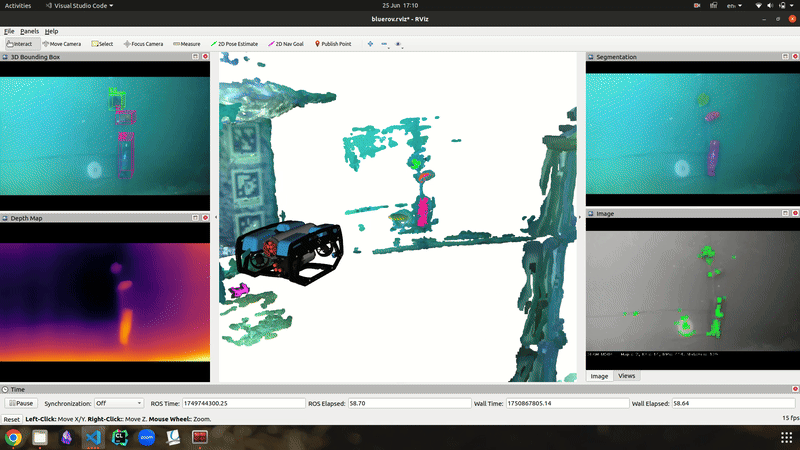
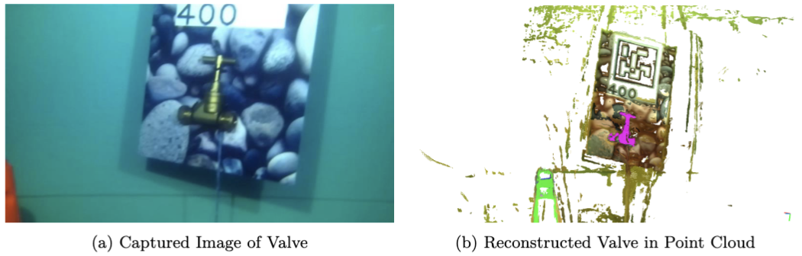
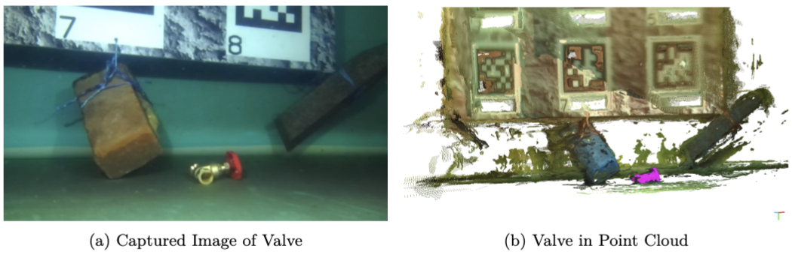
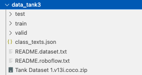

# Vision-Enabled Underwater Robots for Autonomous Operations

This repository contains the code from my Final Year Project at Imperial College London 2025. This project introduces an __Underwater Detection and Semantic Mapping Framework__ developed and deployed on a BlueROV2 robot as part of a broader effort to enable vision-based autonomous underwater operations.

## Contents
- [Overview](#overview)
- [Installation](#installation-steps)
- [Run Demo for Object Detection](#run-demo-for-object-detection)
- [Run Demo for Map Generation](#run-demo-for-map-generation)
- [Acknowledgements](#acknowledgements)

## Overview



The project utilises a _YOLO-World_ object detection model trained on a self-collected dataset of around 1000 images and 9 object classes. _DepthAnythingV2_ is used to generate the depth maps and to obtain relative depths of objects in a scene. This pipeline is able to run real-time at about 4.7FPS on laptop hardware. 

Underwater map generation is achieved through the use of _YOLO-World_ for object detection, _EfficientViTSAM_ for image segmentation, and an adaptation of the _RoMa_ feature matching model for stereo matching. The output of this pipeline is a dense point cloud with semantic annotations of objects of interest. Examples of the annotated point clouds are shown below.




## Installation Steps
1. Clone this repository
```bash
git clone https://github.com/SenseRoboticsLab/Underwater_Sematic_Mapping.git
cd Underwater_Sematic_Mapping
```
2. Install required packages 
```bash
pip install -r requirements.txt
```
Next, install **mmcv**. YOLO-World is built on mmcv, and the newest pre-built package only supports cuda 12.1 and torch 2.4.

```bash
pip install mmcv==2.2.0 -f https://download.openmmlab.com/mmcv/dist/cu121/torch2.4/index.html
```

The other option is to build mmcv from source, but this takes a much longer time (not recommended).
```bash
pip install -U openmim
mim install mmcv==2.2.0
```

3. Download checkpoints

YOLO-World:
```bash
mkdir YOLO_world/weights/pre_train
wget -P YOLO_world/weights/pre_train https://huggingface.co/wondervictor/YOLO-World-V2.1/resolve/main/l_stage2-b3e3dc3f.pth

mkdir -p YOLO_world/weights/finetune
wget -P YOLO_world/weights/finetune https://huggingface.co/Tianqi13/FYP_ObjectDetection/resolve/main/l_finetune.pth

mkdir YOLO_world/weights/prompt_tune
wget -P YOLO_world/weights/prompt_tune https://huggingface.co/Tianqi13/FYP_ObjectDetection/resolve/main/l_prompt_tuned.pth
```

DepthAnythingV2 (Not needed for Map Generation):
```bash
mkdir -p DepthV2/checkpoints

#vits works fine, but if you want to use other configurations you can download all the weights
wget -P DepthV2/checkpoints https://huggingface.co/depth-anything/Depth-Anything-V2-Small/resolve/main/depth_anything_v2_vits.pth 
```

EfficientViTSAM:
```bash
mkdir -p EfficientViTSAM/assets/checkpoints/efficientvit_sam

#vits works fine, but if you want to use other configurations you can download all the weights
wget -P EfficientViTSAM/assets/checkpoints/efficientvit_sam https://huggingface.co/mit-han-lab/efficientvit-sam/resolve/main/efficientvit_sam_l0.pt
```

## Run Demo for Object Detection
The 2 python scripts for Object Detection demonstration are: 
1. run_image.py: This draws bounding boxes on an input image.  

To change the input image, model configs, or thresholds, look for this part in the script:

```python
# ''' CHANGE CONFIGURATIONS IF NEEDED
path_to_image = 'test_images/img_coke.png'
output_path = 'output_bbox_image.png'
class_names=['bottle', 'cup', 'soda can', 'cone']
detector = ObjectDetector(model_weights='finetuned', class_names=class_names)   
depth_estimator = DepthEstimator(model_config='vits')    
score_thr = 0.65 #reduce this if you want to detect more objects, but it will also increase false positives
nms_thr = 0.5                                              
# '''
```

2. run_batch_video.py: This draws bounding boxes on an input video. 
Similarly, look for this part in the script to change the configurations:

```python
# ''' CHANGE CONFIGURATIONS IF NEEDED
source = "test.mp4"  # Path to input video file
output_path = "output_bbox_video.mp4"  # Path to output video file
class_names=['bottle','cone','cup','rubiks cube','soda can','star','valve','weight','wooden cube']
detector = ObjectDetector(model_weights='finetuned', class_names=class_names)
depth_estimator = DepthEstimator(model_config='vits')
score_thr = 0.5
nms_thr = 0.7
detection_batch_size = 4  # Detection is faster than depth estimation, so use a smaller batch size than depth to reduce bottleneck
depth_batch_size = 10
depth_interval = 8 # Compute depth every N frames to reduce load
depth_input_size = 720 # The size of a frame
# '''
```
You can also download a sample video "test.mp4". 
```bash
wget https://huggingface.co/Tianqi13/FYP_ObjectDetection/resolve/main/test.mp4
```

**Note:** You may run into this error: "AssertionError: MMCV==2.2.0 is used but incompatible. Please install mmcv>=2.0.0rc4, <2.1.0. You can edit the source file's 'mmcv_maximum_version' to 2.2.1." 
There are two source files where this needs to be changed, one in python3.12/site-packages/mmdet/\_\_init.py\_\_ and another in python3.12/site-packages/mmyolo/\_\_init.py\_\_.


## Run Demo for Map Generation
First, get keyframe images from a ROS bag using the `bag2keyframes.py` script.

For the map generation pipeline, you can run the script `run_map_gen.py`. You might need to change the camera intrinsics, the `K.txt` file in the RoMa folder. 

Change the paths in the script to point to your keyframe images and text file:
```python 
keyframe_txt = 'map_gen/keyframe_images.txt'
keyframe_L = 'map_gen/img_L_kp'
keyframe_R = 'map_gen/img_R_kp'
```
Also change the output path where the point clouds will be saved:
```python
output_path = '/home/pro/Desktop/tianqi_FYP/FYP_ObjectDetection/point_clouds'
```

### Steps to train a model 
1. Edit the **mmdet** python package files to include your custom dataset. 
In the ~lib/python/site-packages/mmdet/datasets folder, create a new python file (e.g. tank.py). Follow the format of the example file in this repository's YOLO_world/example_files/tank.py. 
Then, edit the "\_\_init.py\_\_" file in lib/python/site-packages/mmdet/datasets as well to include your dataset. An example is in the YOLO_world/example_files/init_mmdet.py. 

2. Edit the **mmyolo** python package files as well. 
In the ~lib/python/site-packages/mmyolo/datasets, create a new python file (e.g. yolov5_tank.py). An example is in YOLO_world/example_files/yolov5_tank.py. Note: it's called yolov5 because they inherit the method that yolov5 uses for batch shaping. 

Similarly, edit the "\_\_init.py\_\_" file in this directory. See example YOLO_world/example_files/init_mmyolo.py.

3. Download your dataset from Roboflow, in the COCO dataset format. Create a folder in YOLO_World as "data" and then unzip the .zip file here. After unzipping, you should see 3 other folders: test, train, valid. They should all contain the images and a .json annotations file. Now, **create a class_texts.json file** in this "data" repository. An example is in YOLO_world/example_files/class_texts.json.

Make sure you also include the supercategory. Check for all categories by ctrl+f in any .json annotations file and search 'categories'. Make sure the your class_texts.json file categories are arranged in the exact same order. 

Your file directory should look something like:



4. Next, edit the YOLO_world/configs/yolo_world_v2_l_vlpan_bn_sgd_1e-3_40e_8gpus_finetune_coco.py configuration file. Check for all the #TODO comments and edit them accordingly. 

5. Also edit the base file that this config file inherits from. It should be in YOLO_world/third_party/mmyolo/configs/yolov8/yolov8_s_syncbn_fast_8xb16-500e_coco.py. Again, read the TODO comments and edit the file. 

6. Finally, run the YOLO_world/tools/train.py script. An example usage is: 
```bash
python tools/train.py \
       /vol/bitbucket/th1422/YOLO-World/vscode/3d/YOLO_world/configs/yolo_world_v2_l_vlpan_bn_sgd_1e-3_40e_8gpus_finetune_coco.py \
       --work-dir /vol/bitbucket/th1422/YOLO-World/vscode/3d/YOLO_world/train/finetune3
```
The first path is the path to the configuration file you edited. The work directory is where the logs and checkpoints will be saved. 

7. After training, you can use your checkpoint by updating the YOLO_world/yolow_detect.py file. Specifically in line 34:
```python 
model_weight_paths = {
    'pretrained': os.path.join(HERE, 'weights', 'pre_train', 'l_stage2-b3e3dc3f.pth'),
    'finetuned': os.path.join(HERE, 'weights', 'finetune', 'l_finetune.pth'),
    'prompt-tuned': os.path.join(HERE, 'weights', 'prompt_tune', 'l_prompt_tuned.pth')
}
```
Update the path to your finetuned checkpoint. You can test your checkpoint by running the run_image.py file. 


## Acknowledgements 
- [YOLO-World](https://github.com/AILab-CVC/YOLO-World) for the object detection model 
- [DepthAnythingV2](https://github.com/DepthAnything/Depth-Anything-V2) for the relative depth estimation model
- [EfficientViTSAM](https://github.com/mit-han-lab/efficientvit) for the image segmentation model 
- [RoMa](https://github.com/Parskatt/RoMa) for the feature matching model 
- [FoundationStereo](https://github.com/NVlabs/FoundationStereo/) for the point cloud generation functions 
- [YOLO-3D-GUI](https://github.com/Pavankunchala/Yolo-3d-GUI) for the bbox3d class 

Author: tianqihu13@gmail.com
